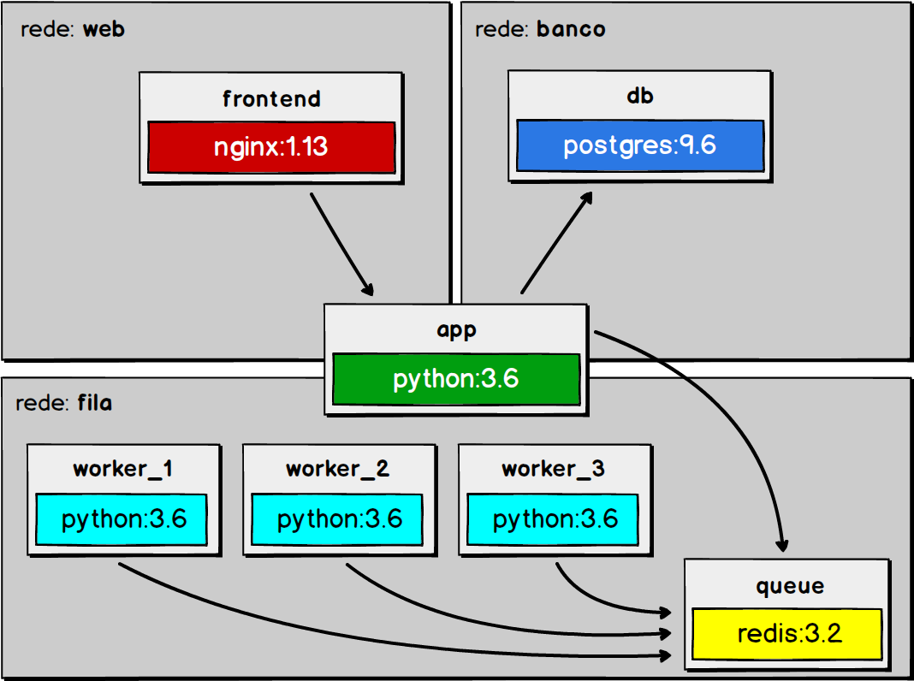

# docker-compose-email
This is a training project using docker-compose to simulate email sending.

#### useful commands
``` sh
docker-compose up -d --scale work=3
docker-compose ps
docker-compose down
```

#### Project Diagram

